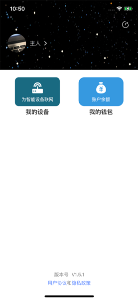

## 目录

* [使用介绍](#introduction)
* [集成使用](#install)

## 使用介绍<a id="introduction"> </a>
1. 首页

首页为一个旋转的球体功能展示，上面显示了TA来了的功能。
用户可以按照功能上的文字展示来语音询问控制APP。例如：用户可以按照球体上的文字信息语音：“今天的天气怎么样”，APP收到语音指令后，会进行TTS的相关播报，并跳转相应的界面展示。回答完用户的相关问题之后，回跳转回首页界面。并且首页的下方会展示，app识别到的语音文字信息。

用户也可以点击球体上的文字信息，文字信息会弹框出相关功能的详细介绍。
用户可以旋转球体来展示更多的功能标签。
右上角的蓝色标签信息来提示用户佩戴耳机，效果更佳，用户也可以点击小X号来关闭标签。

&nbsp;&nbsp;


2. 个人中心

左滑界面，为个人中心界面。在这个界面内部可以修改用户的个人信息。下方有两个按钮，分别为我的设备、我的钱包。其中我的设备按钮中可以配置管理SoundAI智能音箱设备。我的钱包中可以将参与答题的余额体现至相关的支付宝账户。



3. 音频播放列表

首页向右侧滑动为音频播放列表界面


4. 播放详情界面

用户可以点击播放列表中的歌曲进行播放，之后会跳转到播放详情界面,用户可以在此界面查看歌词等信息。还可以切换上下首，以及相关列表的展示和播放模式的设置。
用户还可以用语音来控制app的相关操作：“上一首”、“下一首”、“循环播放”、“回到首页”等等一系列的操作。


## 集成使用<a id="install"> </a>

1. 快速使用

1）下载源码导入Android studio

2）将申请的client id 、product id 填入MyApplication，并传入设备唯一标识，可使用提供的Utils.getimei方法获取设备imei ,如该方法无法获取，则需要自行传入设备唯一标识，其他默认即可。示例如下所示：

```kotlin
 val config = Config(
    "", //productId  产品ID，Azero开发者网站上申请，设备信息中填写
    "", //clientId  Azero开发者网站上自动生成，设备信息页可查询
    "", //devicesn  设备唯一标识，需保证该ID唯一且不能为空
    "", //server  选择使用的服务器  FAT 测试环境 PRO 正式环境
    true  //enableLocalVAD   是否启用本地vad检测，默认启用
)
```

3）运行编译出来的软件即可体验TA来了功能


2. 渲染界面

配合语音交互指令，TemplateRuntimeHandler会下发配套的界面内容，用户可根据自己的需求，渲染界面
```kotlin
   private val templateDispatcher by lazy {
        object : TemplateDispatcher() {
            //显示模板类界面(如显示天气UI、问答百科，自定义模板等)
            override fun renderTemplate(payload: String, type: String) {
                if (!ActivityLifecycleManager.getInstance().isAppForeground) {
                    if (PENDING_TEMPLATE_LIST.contains(type)) {
                        pendingTemplate = Triple(payload, type, System.currentTimeMillis())
                    }
                    return
                }
                dispatchTemplate(payload, type)
            }

            //显示播放界面（如播放的音乐资源、相声、新闻等资源参数）
            override fun renderPlayerInfo(payload: String) {
                dispatchPlayerInfo(payload)
            }
        }
    }
```


3. 获取首页球体数据

```kotlin
AzeroManager.getInstance().sendQueryText("获取指南球体数据")
```
4. 解析球体数据

球体数据是通过模板TemplateDispatcher中的renderTemplate下发的，type类型为SphereTemplate
```kotlin
    private fun onSphereTemplate(payload: String) {
        launch(coroutineExceptionHandler) {
            skillFragment.initData(payload, this@LauncherActivity)
        }
    }
```

5. AzeroManager

1) 创建对象

AzeroManager类实现了单例模式，提供如下获取方式
```kotlin
 AzeroManager azeroManager = AzeroManager.getInstance()
```

2) 初始化
```kotlin
startEngine(@NotNull Context context,
            @NotNull Config config,
            @NotNull HandlerContainer container)

```
3) 播放控制
```kotlin
executeCommand(@NotNull Command command)
```
源码中 中实现了一个简单的、用于显示正在播放的媒体的页面，主要逻辑代码位于 PlayerInfoActivity中，其中真正触发播放控制的是以下代码
| Command                     | 说明                      |
| --------------------------- | ------------------------- |
| CMD_PLAY_PLAY               | 播放指令                  |
| CMD_PLAY_PAUSE              | 暂停指令                  |
| CMD_PLAY_NEXT               | 下一首                    |
| CMD_PLAY_PREVIOUS           | 上一首                    |
| CMD_VOLUME_UP               | 音量增大（10%）           |
| CMD_VOLUME_DOWN             | 音量降低（10%）           |
| CMD_PLAY_AUDIO_SERVER_ERROR | 播放提示音-服务器连接失败 |
| CMD_PLAY_AUDIO_NET_ERROR    | 播放提示音-网络无法连接   |

4) 文字请求tts
```kotlin
/**
 * 请求tts播报的接口，发送文字，sdk即可直接播放对应的tts流
 * 注：使用该接口，需联系声智产品人员开通
 * @param content
 */
public static void acquireTts(String content) {
    Utils.acquireTts(content);
}
```

5) 发送文字query
```kotlin
/**
 * 发送文字模拟语音输入
 * @param query 模拟语音的文字接口
 */
public static void sendQueryText(String query) {
    Utils.sendQueryText(query);
}
```

6） 停止所有播放器
```kotlin
public void stopAllPlayers()
```

7) 获取系统功能模块
```kotlin
public PlatformInterface getHandler(String name)
```
| Handler                   | 说明       |
| ------------------------- | ---------- |
| ALERT_HANDLER             | 闹钟       |
| AUDIO_HANDLER             | 音频播放器 |
| SPEAKER_HANDLER           | TTS播放器  |
| SPEECH_RECOGNIZER_HANDLER | 识别数据   |
| TEMPLATE_HANDLER          | 显示模板   |
| AZERO_CLIENT_HANDLER      | 连接状态   |

8) 系统事件
```java
public void addAzeroOSListener(AzeroOSListener listener)
public void removeAzeroOSListener(AzeroOSListener listener)
```
| AzeroEvent                           | Msg  | 说明               |
| ------------------------------------ | ---- | ------------------ |
| EVENT_AUTH_STATE_CHANGE              |      | Auth状态变化       |
| EVENT_AUTH_STATE_ERROR               |      | Auth失败           |
| EVENT_CONNECTION_STATUS_CHANGED      |      | Server连接状态变化 |
| EVENT_ENGINE_INITIALIZATION_COMPLETE |      | 系统初始化完成     |
| EVENT_VOLUME_CHANGE                  |      | 系统音量变化       |

9) 播放器的状态回调
```java
        MediaPlayerHandler mediaPlayerHandler = (MediaPlayerHandler) AzeroManager.getInstance().getHandler(AzeroManager.AUDIO_HANDLER);
        mediaPlayerHandler.setAudioPlayerListener(new MediaPlayerHandler.AudioPlayerListener(){
        @Override
        void onAudioPlayerStopped();
        @Override
        void onAudioPlayerStarted();
        @Override
        void prepare();
        @Override
        void play();
        @Override
        void stop();
        @Override
        void pause();
        @Override
        void resume();
        @Override
        void seekTo(long position);

        })
```

10) 获取tts音频播放器状态
```java
        RawSpeakAudioMediaPlayerHandler speakerMediaPlayerHandler = AzeroManager.getInstance().getSpeakerMediaplayerHandler();
        speakerMediaPlayerHandler.setRawSpeakAudioMediaPlayerListener(new RawSpeakAudioMediaPlayerHandler.RawSpeakAudioMediaPlayerListener() {
            @Override
            public void onSpeakerMediaPlayerStopped() {}
            @Override
            public void onSpeakerMediaPlayerStarted() {}
            @Override
            public void prepare() {}
            @Override
            public void play() {}
            @Override
            public void stop() {}
            @Override
            public void pause() {}
            @Override
            public void resume() {}
            @Override
            public void seekTo(long position) {}
        });
    }
```

6.  APP接口协议

注册、登录、绑定设备等接口可参考
- [App接口协议文档](https://document-azero.soundai.com.cn/azero/surrogate.html)


7. 声音采集

默认配置了声智自有的声学算法Open Denoise，支持远场麦克风阵列的降噪、唤醒、AEC等。

录音可参考 MonoSystemRecord类，采样率为 16k；采样位深为 16bit，pcm格式单声道
```kotlin
val minBufferSize = AudioRecord.getMinBufferSize(
    sSampleRateInHz,
    AudioFormat.CHANNEL_IN_MONO,
    AudioFormat.ENCODING_PCM_16BIT
)
val bufferSize =
    minBufferSize + sAudioFramesInBuffer * sSamplesToCollectInOneCycle * sBytesInEachSample
audioRecord = AudioRecord(
    TaAudioManager.getPreferedAudioSource(), sSampleRateInHz,
    AudioFormat.CHANNEL_IN_MONO, AudioFormat.ENCODING_PCM_16BIT,
    bufferSize
)
```

```kotlin
private fun initSaiClient(configPath: String, denoiseCallback: DenoiseCallback?): Int {
     return saiClient!!.init(
         context,
         true,
         configPath,
         "ViewPageHelper",
         AzeroManager.getInstance().generateToken(context),
         object : SaiClient.Callback {
             override fun onAsrDataCallback(data: ByteArray, size: Int) {
                 denoiseCallback?.onAsrData(data, size)
             }

             override fun onVoipDataCallback(bytes: ByteArray, size: Int) {
                 denoiseCallback?.onVoIpData(bytes, size)
             }

             override fun onWakeupCallback(
                 wakeup_angle: Float,
                 wakeup_word: String,
                 score: Float,
                 data: ByteArray
             ) {
                 if (!TaApp.isEarphoneMode) {
                     log.e("wakeup word = " + wakeup_word)
                     when (wakeup_word) {
                         "xiaoyixiaoyi" -> {
                               if (filterWakeup) {
                                   filterWakeup = false
                                   return
                               }
                             log.d("=====EarMode Wake up!angle:" + wakeup_angle + "word:" + wakeup_word)
                             angle = wakeup_angle
                             isWakeUp = true
                             filterFirstVAD = false
                             denoiseCallback?.onWakeUp(wakeup_word)
                             if (lastVAD != VAD_BEGIN) {
                                 vadEndTimer.cancel()
                                 vadbeginTimer.cancel()
                                 vadbeginTimer.start()
                             }
                         }
                         else -> {
                             denoiseCallback?.onWakeUp(wakeup_word)
                         }
                     }
                 }
             }

             override fun onVadCallback(vadResult: Int) {
                 log.e("localVad:$vadResult BT = ${!TaAudioManager.isBTHeadsetConnected()}, lastVad = ${lastVAD}")
                 if (!mEnableLocalVad || !TaAudioManager.isBTorWiredHeadsetConnected()) {
                     return
                 }
                 if (TaApp.isEarphoneMode) {
                     if (vadResult == VAD_BEGIN && lastVAD != 0) {
                         vadCutWhileWakeFreeMode.start()
                         denoiseCallback?.onWakeUp("xiaoyixiaoyi")
                     } else if (vadResult == VAD_ENG || vadResult == 2) {
                         vadCutWhileWakeFreeMode.cancel()
                         denoiseCallback?.onVadCallback(VAD_ENG)
                     }
                     lastVAD = vadResult
                 }else{
                     log.d("localVad:$vadResult")
                     if (filterFirstVAD) {
                         filterFirstVAD = false
                         log.e("filter")
                         return
                     }
                     denoiseCallback?.onVadCallback(vadResult)
                     if (vadResult == VAD_BEGIN) {
                         log.d("lastVAD: $lastVAD")
                         //重复收到vadBegin事件，避免重新计时
                         if (lastVAD != VAD_BEGIN) {
                             vadbeginTimer.cancel()
                             vadEndTimer.start()
                         }
                     } else if (vadResult == VAD_ENG) {
                         vadEndTimer.cancel()
                     }
                     lastVAD = vadResult
                 }
             }
         }
     )
 }
```
